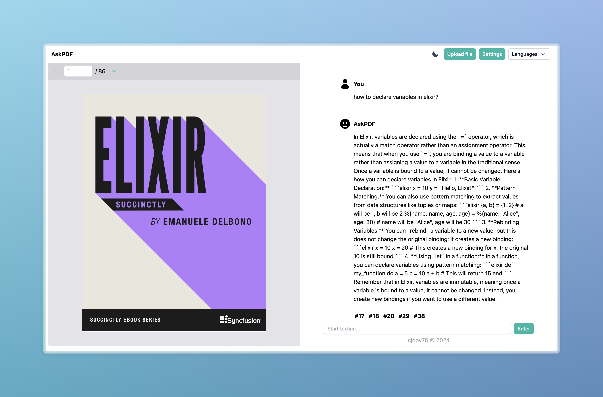

# AskPDF

Ａ PDF Reader Application comes with integrated chat, allowing you to have real-time discussions, powered by LLM and RAG technology.

### Development Setup

1. Clone the repo
2. Run `pnpm install` and `pnpm dev`
3. Open http://localhost:3000
